# MLPerf Storage 场景驱动的 AI SSD 测试方案

**版本**：1.0  
**日期**：2026-08-02  
**定位**：以本仓库的 Training、Checkpointing、KV Cache、VectorDB 场景评价 AI SSD  
**核心输出**：18 项可追踪测试需求、72 个测试 Case、执行流程、监控检测、判定方法和当前 Windows 落地范围

## 1. 测试目标

本方案不以 NVMe 协议符合性为主，也不把峰值顺序带宽当作 AI SSD 结论。核心问题是：

1. SSD 能否持续向训练任务供应不同形态的数据，并让模拟加速器达到目标 AU。
2. SSD 能否在大模型 Checkpoint 突发写入后，完成持久化和冷态恢复读取。
3. KV Cache 从 GPU/CPU 内存下沉到 NVMe 时，能否维持 tokens/s 和 P95–P99.99 尾延迟 SLA。
4. VectorDB 在建库、索引、加载、ANN 查询和后台写入时，能否同时维持 Recall 和 QPS。
5. 多种 AI 工作负载共用一块 SSD 时，前台尾延迟和后台吞吐会下降多少。

协议、PLP、Sanitize 和固件测试只保留为可选健康门禁，不进入本轮 72 个核心 Case。

## 2. 仓库中的 AI I/O 场景

### 2.1 Training 模型与数据形态

数据来自 `configs/dlio/workload/*.yaml`。完整数据量是按配置字段估算的逻辑量，正式运行应以 `mlpstorage ... datasize` 的结果为准。

| 模型/加速器配置 | 格式 | 典型单文件 | 配置文件数/总量 | I/O 特征 | 最低 AU | 状态 |
|---|---|---:|---:|---|---:|---|
| UNet3D/A100 | NPZ | 139.8 MiB | 168 / 23.5 GiB | 少量大文件、吞吐型读取 | 90% | whatif |
| UNet3D/H100 | NPZ | 139.8 MiB | 168 / 23.5 GiB | H100 compute gap 更短、存储压力更高 | 90% | YAML 存在，README 未列支持，实验性 |
| UNet3D/B200 | NPZ | 139.8 MiB | 7200 / 983 GiB | 大文件、高持续读带宽 | 90% | v3.0 |
| RetinaNet/B200 | JPEG | 315 KiB | 1,170,301 / 352 GiB | 百万级小文件、metadata/IOPS | 85% | v3.0 |
| RetinaNet/MI355 | JPEG | 315 KiB | 1,170,301 / 352 GiB | 小文件，batch/compute 不同 | 85% | v3.0 |
| CosmoFlow/A100 | TFRecord | 2.70 MiB | 524,288 / 1.38 TiB | 大量中小对象、随机 shuffle | 70% | whatif |
| CosmoFlow/H100 | TFRecord | 2.70 MiB | 524,288 / 1.38 TiB | 更高请求速率 | 70% | whatif |
| ResNet50/A100 | TFRecord | 136.8 MiB | 1024 / 136.8 GiB | 大文件内多 sample 读取 | 90% | whatif |
| ResNet50/H100 | TFRecord | 136.8 MiB | 1024 / 136.8 GiB | 更短 compute gap | 90% | whatif |
| DLRM/B200 | Parquet | 约 1.09 GiB | 1024 / 1.09 TiB | row-group、列选择、混合 metadata/data | 70% | whatif |
| DLRM/MI355 | Parquet | 约 1.09 GiB | 1024 / 1.09 TiB | Parquet 并行读取 | 70% | whatif |
| Flux/B200 | Parquet | 594.6 MiB | 4296 / 2.44 TiB | 大型编码对象、较低请求频率 | 90% | whatif |
| Flux/MI355 | Parquet | 594.6 MiB | 4296 / 2.44 TiB | batch 72、较长 compute gap | 90% | whatif |

这些模型分别覆盖：大文件带宽、小文件 IOPS、TFRecord 批内访问、Parquet row-group/列裁剪，以及不同模拟 accelerator think-time。

### 2.2 Checkpointing 模型

| 模型 | Full processes | Full checkpoint | 8-process subset | 主要 SSD 压力 |
|---|---:|---:|---:|---|
| Llama3-8B | 8 | 105 GB | 不适用 | 单节点大块写和恢复读 |
| Llama3-70B | 64 | 912 GB | 114 GB | 多 rank 并发写、rank 抖动 |
| Llama3-405B | 512 | 5.29 TB | 94 GB | 大规模并行、optimizer/model 分片差异 |
| Llama3-1T | 1024 | 18 TB | 161 GB | 极大 checkpoint、容量和恢复窗口 |

有效的正式流程是 10 次 Save、必要时清文件缓存、再 10 次 Load。写入启用 `fsync`。单次结果使用最慢 rank 的完成时间和最小 rank 吞吐，而不是平均值。

### 2.3 KV Cache 模型和对象大小

| 模型 | KV bytes/token | 8K context/rank | 接入方式 | 测试价值 |
|---|---:|---:|---|---|
| tiny-1b | 24 KiB | 0.19 GiB | mlpstorage/direct CLI | smoke、小对象 |
| mistral-7b | 128 KiB | 1.00 GiB | mlpstorage/direct CLI | GQA 基线 |
| llama2-7b | 512 KiB | 4.00 GiB | mlpstorage/direct CLI | 本仓库最大 KV/token，SSD 压力上界 |
| llama3.1-8b | 128 KiB | 1.00 GiB | mlpstorage/direct CLI | MLPerf option 1/2 |
| llama3.1-70b-instruct | 320 KiB | 2.50 GiB | mlpstorage/direct CLI | MLPerf option 3 |
| deepseek-v3 | 68.6 KiB | 0.54 GiB | direct CLI what-if | MLA 压缩 KV |
| qwen3-32b | 256 KiB | 2.00 GiB | direct CLI what-if | 中等对象、大模型 |
| gpt-oss-20b | 48 KiB | 0.38 GiB | direct CLI what-if | MoE、小 KV 对象 |
| gpt-oss-120b | 72 KiB | 0.56 GiB | direct CLI what-if | 大模型但低 KV/token |

MLPerf 固定选项是：

| Option | 模型 | Users | GPU tier | CPU tier | Max concurrent allocs | 含义 |
|---|---|---:|---:|---:|---:|---|
| 1 | Llama3.1-8B | 200 | 0 GB | 0 GB | 16 | NVMe-only、高并发 |
| 2 | Llama3.1-8B | 100 | 0 GB | 4 GB | 16 | CPU 缓存后溢出到 NVMe |
| 3 | Llama3.1-70B | 70 | 0 GB | 0 GB | 4 | 大对象、受控并发 |

可配置维度还包括：GPU/CPU/NVMe tier 容量、TP 1/2/4/8、prefill-only、decode-only、generation `none/fast/realistic`、chatbot/coding/document context、RAG、prefix cache、multi-turn、BurstGPT/ShareGPT、request rate 和 autoscaling。

### 2.4 VectorDB 模型

| 仓库配置 | Vectors | Dimension | Index | Shards | 主要目的 |
|---|---:|---:|---|---:|---|
| windows trace smoke | 1K | 128 | HNSW | 1 | Windows 链路验证 |
| 1m_hnsw | 1M | 1536 | HNSW | 1 | 内存型图索引查询 |
| 1m_diskann | 1M | 1536 | DISKANN | 1 | 磁盘型 ANN 基线 |
| 1m_diskann_512dim | 1M | 512 | DISKANN | 1 | 维度影响 |
| 1m_aisaq_512dim | 1M | 512 | AISAQ | 1 | 压缩索引/低容量 |
| 10m_hnsw | 10M | 1536 | HNSW | 10 | 大数据集、分片扩展 |
| 10m_diskann | 10M | 1536 | DISKANN | 10 | 大数据集、磁盘访问 |

核心指标是 ingest rate、flush/compact/index build time、QPS、Recall@K、P50/P90/P99 和物理 I/O。所有索引性能比较必须在相同 Recall 门槛下进行。

## 3. 测试 Profile

| Profile | 目的 | 时长/规模 | 判定用途 |
|---|---|---|---|
| S0 Smoke | 验证命令、数据、监控、结果格式 | 1–10 min，小数据集 | 只判链路，不做 SSD 排名 |
| Q1 Single-SSD | 当前 Windows 单盘资格测试 | 30–60 min，3 次重复，工作集避开缓存 | 形成单盘场景成绩单 |
| Q2 Scale | 完整数据量、多 rank、多客户端 | 正式模型规模，3 次或规则要求次数 | 系统/产品资格 |
| X What-if | 扩展模型、参数扫描和拐点分析 | 变量 sweep | 工程画像，不作为 MLPerf submission |
| M Mixed/Soak | 业务共存和长时间稳定性 | 2–8 h | 干扰和稳定性结论 |

## 4. 可追踪测试需求

| TR ID | Source | Requirement | Test Objective | Preconditions | Stimulus | Observability | Pass Criteria | Negative/Boundary Coverage | Priority | Trace Tags |
|---|---|---|---|---|---|---|---|---|---|---|
| TR-AI-BASE-001 | `ManPage.md` Common artifacts | 每个结果必须绑定配置、DUT、路径和原始产物 | 保证结果可重跑和可比较 | 结果目录不在 DUT；固定版本/seed | 采集 metadata、timeseries、stdout/stderr 和 DUT 映射 | manifest、artifact hash、时间覆盖 | 必需产物齐全；身份和参数无漂移 | 盘符变化、日志缺失、时钟跳变 | P0 | evidence, reproducibility |
| TR-AI-TRAIN-001 | `training/README.md` Minimum dataset size | 训练数据集必须满足 500 steps 和 5×host-memory 中较大者 | 防止 RAM cache 抬高 SSD 成绩 | 先执行 datasize；容量 gate 通过 | datasize→datagen→run | 文件数、总字节、内存、实际磁盘读 | run 文件数在 datasize/datagen 范围内 | 缩小数据集、warm cache、空间不足 | P0 | training, dataset, cache |
| TR-AI-TRAIN-002 | workload YAML | SSD 必须覆盖 NPZ/JPEG/TFRecord/Parquet 数据形态 | 评价带宽、IOPS、metadata 和列式读取 | 对应模型数据已生成 | 逐模型跑固定 epochs | samples/s、AU、epoch time、disk read | 无读取错误；结果产物完整 | 大/小文件、shuffle、row-group、列选择 | P1 | training, data-shape |
| TR-AI-TRAIN-003 | `training/README.md` Performance Metrics | 在达到模型最低 AU 时最大化 samples/s | 证明 SSD 不阻塞模拟 accelerator | 数据量有效；compute config 固定 | 正式 run，至少三次 | AU、samples/s、GiB/s、per-epoch CV | AU≥模型门槛；吞吐≥批准目标；CV≤5% | accelerator 数、cold/warm/direct | P1 | training, au, throughput |
| TR-AI-TRAIN-004 | training CLI/configs | 性能应随 accelerator/reader 并发扩展到可解释饱和点 | 找单盘最大可支持 accelerator 数 | 单 worker baseline 有效 | accelerator/threads 阶梯 | speedup、AU、disk util、queue、CPU | 给出最大 AU 合格点；拐点可归因 | 1/2/4/8/16 accelerator，1–32 threads | P1 | training, scaling |
| TR-AI-CKPT-001 | `checkpointing/README.md` Models | SSD 必须覆盖 8B/70B/405B/1T checkpoint 大小 | 评价容量和突发大块 I/O | 容量 gate 通过；rank layout 固定 | 对各模型执行 subset/full | rank bytes、duration、throughput、skew | 所有 rank 完成；字节数符合模型 | subset/full、model/optimizer shard | P1 | checkpoint, model-scale |
| TR-AI-CKPT-002 | Checkpoint write/recovery | 有效流程必须完成 10 Save + 10 cold Load 且写入持久 | 评价训练保存窗口和故障恢复窗口 | fsync 开启；冷缓存方法可验证 | write-only→cache clear→read-only | 最慢 rank time、最小 throughput、hash/error | 10+10 完成；0 损坏；RTO/吞吐达标 | kill、空间不足、慢 rank、读写分离 | P0/P1 | checkpoint, durability, recovery |
| TR-AI-CKPT-003 | Checkpoint cache rule | checkpoint/node 小于 3×RAM 时必须清 cache | 防止恢复读命中页缓存 | 记录每节点 RAM 和 checkpoint bytes | 分别跑 warm/cold read | PhysicalDisk read bytes、load time | 冷读实际访问 DUT；否则标 warm-only | Windows 无 drop_caches、重启、cache purge 失败 | P0 | checkpoint, cold-read |
| TR-AI-KV-001 | KV WORKLOAD_PARAMS/options | MLPerf option 1/2/3 必须产生真实 NVMe tier I/O | 验证 NVMe-only 和 CPU spill | `cache-dir` 位于 DUT；storage capacity 正确 | 每 option 三 trials | storage_entries、tier bytes/BW、worst P95 | storage_entries>0；无 rank/trial 缺失 | CPU tier 吸收全部 I/O、目录落错盘 | P0 | kv, mlperf-options, offload |
| TR-AI-KV-002 | `kv_cache_benchmark/config.yaml` models | SSD 必须覆盖不同 KV bytes/token 和 TP 分片大小 | 评价对象大小对吞吐/尾延迟的影响 | 固定 context/users，模型配置有效 | 9 模型和 TP sweep | object-size、IOPS、BW、P95–P99.99 | 各配置无错误；满足对应 QoS | 24–512 KiB/token、TP1–8 | P1 | kv, model, tensor-parallel |
| TR-AI-KV-003 | KV phase/context config | SSD 必须覆盖 prefill 写、decode 读和混合多轮 | 分解读写瓶颈 | decode-only 已预置 cache | prefill/decode/mixed；persona/RAG/prefix | read/write ratio、hit/evict、latency、tokens/s | phase 行为与期望一致；SLA 达标 | 长 context、RAG、prefix on/off、multi-turn | P1 | kv, prefill, decode, rag |
| TR-AI-KV-004 | QoS/autoscaler config | 找到满足 QoS 的最大 users/request-rate | 得到 SSD 的 KV 服务容量 | 预处理完成；duration 足够 | users/rate +20/25% 阶梯 | P95/P99/P99.9/P99.99、queue、tokens/s | 输出最大合格负载；无未解释崩溃 | burst、none/fast/realistic、overload recovery | P1 | kv, qos, saturation |
| TR-AI-KV-005 | `io_trace_log_usage.md` | trace 只能回放 Tier-2 且保持时间/对象关系 | 生成可复现 Windows SSD 负载 | CSV 校验通过；Read 对象可预置 | 1×/2×/4× Direct replay | ops、logical/aligned bytes、P50/P95/P99 | 仅 Tier-2；无缺对象/时间倒退 | trace-only 无真实 I/O、unfiltered tier | P0 | kv, trace, replay |
| TR-AI-VDB-001 | VDB configs/load workflow | SSD 必须覆盖 ingest、flush、compact 和 index build | 评价写入与建索引阶段 | Milvus healthy；collection 固定 | 1M/10M、index/batch/compact sweep | vectors/s、phase time、physical bytes、capacity | row count 正确；阶段完成；无错误 | 512/1536 dim、1/10 shards、batch 1K/10K | P1 | vdb, ingest, index |
| TR-AI-VDB-002 | vdbbench search results | 搜索性能必须在 Recall 门槛下比较 | 防止用降低精度换 QPS | ground truth、seed、top-k 固定 | query process/batch/search-effort sweep | Recall@K、QPS、P50/P90/P99 | Recall≥目标；QPS/P99 达标 | cold/warm、topK10/100、ef/search-list | P1 | vdb, recall, qps, latency |
| TR-AI-VDB-003 | `TRACE_REPLAY.md` | VDB 逻辑 trace 与 Milvus 物理 I/O 必须分层报告 | 得到可回放负载并量化放大 | 正式 benchmark 同时监控 DUT | record→Direct replay→physical compare | logical/device bytes、amplification、P99 | trace 完整；口径不混用 | search-only、both、1×/2×/4× | P1 | vdb, trace, amplification |
| TR-AI-MIX-001 | AI 共存场景 | 前台 KV/VDB 在 training/checkpoint 后台负载下保持 SLA | 评价同盘干扰和 QoS 隔离 | 各 workload solo baseline 已建立 | 两类负载并发和负载阶梯 | foreground tail、background BW、queue/temp | 默认前台 P99≤1.5×solo；后台≥0.8×solo | read/read、read/write、write/write | P1 | mixed, interference |
| TR-AI-OBS-001 | repository timeseries + Windows monitor | 必须证明 workload 实际命中 DUT 且主机未成为瓶颈 | 保证结果可归因于 SSD | 1 s 外部监控；仓库 timeseries 开启 | 全程采集 disk/CPU/RAM/temp/process | bytes、IOPS、latency、queue、CPU、paging | 无监控缺口；无主机瓶颈；开销≤2% | localized counters、Docker VHDX、cache hit | P0 | observability, validity |

## 5. 测试 Case 矩阵

详细、可导入版本见 [`AI_SSD_WORKLOAD_TEST_MATRIX.csv`](AI_SSD_WORKLOAD_TEST_MATRIX.csv)。这是本方案的唯一执行矩阵；旧的 `AI_SSD_TEST_MATRIX.csv` 属于协议型草案，不纳入本轮评审或结果统计。`Now` 表示当前 Windows 主机可执行；`Scaled` 表示需要更多容量/节点；`Experimental` 表示 what-if 或仓库文档尚未正式支持。

### 5.1 基础 Case（4）

| Case | Profile | 目的 | 配置 | 核心判定 | 当前状态 |
|---|---|---|---|---|---|
| AI-BASE-001 | S0 | DUT/路径/容量建档 | 4 块盘、卷映射、结果盘分离 | cache/data/result 路径均映射正确 | Now |
| AI-BASE-002 | Q1 | Buffered cold/warm/Direct 对照 | 同一 trace/数据集三种路径 | 三类结果独立，不混报 | Now |
| AI-BASE-003 | Q1 | 重复性和监控开销 | 3 runs；monitor off/on | throughput CV≤5%，开销≤2% | Now |
| AI-BASE-004 | Q1/X | SSD 填充率影响 | 20/50/80/90% fill | 输出各场景退化曲线 | 需授权测试目录 |

### 5.2 Training Case（16）

| Case | 模型配置 | 测试目的 | 关键变量 | 主要指标 | 当前状态 |
|---|---|---|---|---|---|
| AI-TRN-001 | UNet3D/A100 | 低压力大文件基线 | accel 1/2/4、direct/cold | AU、samples/s、GiB/s | Now-X |
| AI-TRN-002 | UNet3D/H100 | compute gap 缩短后的存储压力 | accel 1/2/4 | AU、吞吐、queue | Experimental |
| AI-TRN-003 | UNet3D/B200 | v3.0 大文件持续读 | datasize、accel 1/2/4/8 | AU≥90%、samples/s | Now-Q1；完整 983 GiB 不建议 |
| AI-TRN-004 | RetinaNet/B200 | 百万级 JPEG 小文件 | accel 1/4/8/16 | AU≥85%、files/s、P99 | Now-Q1 |
| AI-TRN-005 | RetinaNet/MI355 | 不同 batch/compute 的小文件压力 | accel 1/4/8/16 | AU≥85%、files/s | Now-Q1 |
| AI-TRN-006 | CosmoFlow/A100 | 2.7 MiB 中小对象+shuffle | accel 1/2/4 | AU≥70%、IOPS | Reduced-X；full 1.38 TiB |
| AI-TRN-007 | CosmoFlow/H100 | 高频中小对象读取 | accel 1/2/4/8 | AU、P99、queue | Reduced-X |
| AI-TRN-008 | ResNet50/A100 | TFRecord 内多 sample | threads/batch 固定 | AU≥90%、samples/s | Now-X |
| AI-TRN-009 | ResNet50/H100 | 更高 TFRecord 供给速率 | accel 1/2/4/8 | AU≥90%、throughput | Now-X |
| AI-TRN-010 | DLRM/B200 | Parquet row-group/列读取 | prefetch 0/2/4 | AU≥70%、row-groups/s | Reduced-X；full 1.09 TiB |
| AI-TRN-011 | DLRM/MI355 | Parquet 并行读取 | threads 1/4/8/16 | AU、CPU、read BW | Reduced-X |
| AI-TRN-012 | Flux/B200 | 595 MiB Parquet 大对象 | threads 4/8/16 | AU≥90%、GiB/s | Reduced-X；full 2.44 TiB |
| AI-TRN-013 | Flux/MI355 | 长 compute gap 下的 burst 读 | batch 72、threads sweep | AU、burst latency | Reduced-X |
| AI-TRN-014 | Closed model scaling | 找最大合格 accelerator 数 | UNet/Retina，1→饱和 | AU 合格点、speedup | Now-Q1 |
| AI-TRN-015 | Reader scaling | 找 SSD/CPU 饱和拐点 | read_threads 1/2/4/8/16/32 | throughput、CPU、queue | Now-X |
| AI-TRN-016 | Cache/path matrix | 量化缓存污染 | warm/cold/`--o-direct` | physical read bytes、AU差 | Now-Q1 |

### 5.3 Checkpoint Case（9）

| Case | 模型/模式 | 测试目的 | 数据量 | 核心判定 | 当前状态 |
|---|---|---|---:|---|---|
| AI-CKP-001 | 8B full, 8 ranks | 单节点 checkpoint 基线 | 105 GB/checkpoint | 10 save/load、fsync、cold read | Smoke only；10份>1 TB |
| AI-CKP-002 | 70B subset, 8 ranks | 单盘模拟 70B 分片 | 114 GB/checkpoint | 最慢 rank、最小 throughput | Smoke only；10份约1.14 TB |
| AI-CKP-003 | 70B full, 64 ranks | 多节点并发写恢复 | 912 GB/checkpoint | rank skew、global duration | Scaled |
| AI-CKP-004 | 405B subset, 8 ranks | 大模型 node-local SSD | 94 GB/checkpoint | save/load、cold bytes | 容量非常紧张 |
| AI-CKP-005 | 405B full, 512 ranks | TB 级 shared storage | 5.29 TB/checkpoint | scale、最慢 rank | Scaled |
| AI-CKP-006 | 1T subset, 8 ranks | 最大单节点分片 | 161 GB/checkpoint | burst/GC、恢复时间 | Smoke only |
| AI-CKP-007 | 1T full, 1024 ranks | 极大模型恢复 | 18 TB/checkpoint | global save/load | Scaled |
| AI-CKP-008 | Cold/warm split | 证明恢复读命中 SSD | write-only→purge/reboot→read-only | PhysicalDisk bytes 与逻辑量一致 | Windows 需定义 cold 方法 |
| AI-CKP-009 | Interval/burst | 评价连续 checkpoint 和后台 GC | interval 5/30/300 s、1/2/10 cycles | 后续 checkpoint 退化、P99 | Q1/X |

### 5.4 KV Cache Case（22）

| Case | 配置 | 测试目的 | 关键变量 | 核心指标/判定 | 当前状态 |
|---|---|---|---|---|---|
| AI-KV-001 | MLPerf option 1 | 8B NVMe-only 高并发 | 200 users、CPU/GPU=0 | worst P95、tokens/s、tier bytes | Now |
| AI-KV-002 | MLPerf option 2 | 4 GB CPU spill 边界 | 100 users、CPU=4 GB | spill 时刻、P95、evictions | Now |
| AI-KV-003 | MLPerf option 3 | 70B 大 KV 对象 | 70 users、allocs=4 | P95、BW、RAM 峰值 | Now |
| AI-KV-004 | tiny-1b | 小对象 smoke/IOPS | users 10→500 | IOPS、P99 | Now-X |
| AI-KV-005 | mistral-7b | 128 KiB/token GQA | context/users sweep | tail latency、BW | Now-X |
| AI-KV-006 | llama2-7b | 512 KiB/token 上界 | alloc 1/2/4/8 | P99.9、OOM guard | Now-X |
| AI-KV-007 | llama3.1-8b | 8B 独立负载曲线 | users 25/50/100/200 | max compliant users | Now |
| AI-KV-008 | llama3.1-70b | 大模型独立负载曲线 | users 10/35/70/140 | max compliant users | Now |
| AI-KV-009 | deepseek-v3 | MLA 压缩 KV | context 4K/8K/25K | 小对象效率 | Direct CLI X |
| AI-KV-010 | qwen3-32b | 256 KiB/token | context/users sweep | P99、BW | Direct CLI X |
| AI-KV-011 | gpt-oss-20b | MoE 小 KV | high users | IOPS、CPU overhead | Direct CLI X |
| AI-KV-012 | gpt-oss-120b | 大模型低 KV/token | users/context sweep | throughput/P99 | Direct CLI X |
| AI-KV-013 | Tier capacity matrix | 找 offload 拐点 | GPU/CPU = 0/4/16/32 GiB | tier occupancy、spill latency | Now simulated tiers |
| AI-KV-014 | TP matrix | 量化 per-rank shard 对象大小 | TP 1/2/4/8，num_gpus≥TP | per-rank bytes、aggregate BW | Now trace/simulation |
| AI-KV-015 | Prefill-only | 写密集 disaggregated prefill | model/users/context | write BW、fsync、P99 | Now |
| AI-KV-016 | Decode-only | 读密集 disaggregated decode | 预置 cache、model/users | read BW、P99.99 | Now |
| AI-KV-017 | Context personas | 短/长上下文对象分布 | chatbot/coding/document | object CDF、tail latency | Now-X |
| AI-KV-018 | Generation modes | 区分峰值与真实节奏 | none/fast/realistic | wall/active BW、SLA | Now-X |
| AI-KV-019 | RAG/prefix/multi-turn | 测复用和额外文档 I/O | on/off、docs 10/100 | hit rate、bytes saved、P99 | Now-X |
| AI-KV-020 | Saturation/autoscale | 找最大合格负载 | users/request-rate +20/25% | knee、queue、recovery | Now-X |
| AI-KV-021 | Tier-2 trace replay | 在 Windows Direct I/O 复现 | filter Tier-2、1×/2×/4× | P50/P95/P99、aligned BW | Now；需先过滤 |
| AI-KV-022 | BurstGPT/ShareGPT | 真实 arrival/context 分布 | trace speed、cycles、dataset | burst tail、queue、drop | 需外部数据集 |

QoS 默认直接使用仓库 `config.yaml`：Interactive 目标 P95/P99/P99.9/P99.99 为 50/100/150/200 ms；Responsive 为 100/200/350/500 ms；Batch 为 1000/5000/7500/10000 ms。

### 5.5 VectorDB Case（16）

| Case | 配置 | 测试目的 | 关键变量 | 核心指标 | 当前状态 |
|---|---|---|---|---|---|
| AI-VDB-001 | 1K×128 HNSW | Windows smoke | planted query、L2 | Recall、QPS、trace完整性 | 已完成 |
| AI-VDB-002 | 1M×1536 HNSW | 内存图索引基线 | M64、ef 32/128/256 | Recall-QPS-P99 | Now |
| AI-VDB-003 | 1M×1536 DISKANN | 磁盘 ANN 基线 | degree64、search list | Recall-QPS、physical read | Now |
| AI-VDB-004 | 1M×512 DISKANN | 向量维度影响 | 与1536维对照 | bytes/query、QPS | Now |
| AI-VDB-005 | 1M×512 AISAQ | 压缩索引效率 | inline_pq 16/32 | capacity、Recall、QPS | Now/engine支持确认 |
| AI-VDB-006 | 10M×1536 HNSW | 大数据集/10 shards | query proc 1/4/8 | scale、load、P99 | Now，约百GB级 |
| AI-VDB-007 | 10M×1536 DISKANN | 大磁盘型索引 | 10 shards | QPS、physical IO、temperature | Now，需足够Milvus空间 |
| AI-VDB-008 | Index family sweep | 同数据比较6种 index | DISKANN/HNSW/AISAQ/IVF/FLAT | 同 Recall 下 QPS/容量 | Open/X |
| AI-VDB-009 | Search effort sweep | 绘制精度—性能曲线 | ef/search-list 32→512 | Recall、QPS、P99 | Now-X |
| AI-VDB-010 | Query process scale | 找并发饱和点 | processes 1/2/4/8/16 | aggregate QPS、queue | Now-X |
| AI-VDB-011 | Search batch scale | 批查询影响 | batch 1/8/32/64 | QPS、per-query P99 | Now-X |
| AI-VDB-012 | Ingest tuning | 写入和建索引效率 | batch 1K/10K、compact on/off | vectors/s、flush/index time | Now-X |
| AI-VDB-013 | TopK/metric/dim | 查询形状影响 | K10/100；COSINE/L2/IP | Recall、result bytes、latency | Now-X |
| AI-VDB-014 | Cold/warm/search-only | 区分 load/cache 影响 | restart/load、重复 round | load time、first/steady P99 | Now |
| AI-VDB-015 | Logical trace replay | SSD 逻辑负载复现 | both/search-only、1×/2×/4× | aligned BW、P99 | 已完成1× |
| AI-VDB-016 | Ingest+search coexist | 后台写对前台搜索影响 | 独立 ingest/query clients | Recall、foreground P99、ingest rate | Orchestrated extension |

### 5.6 混合负载 Case（5）

| Case | 前台 | 后台 | 测试目的 | 默认判定 |
|---|---|---|---|---|
| AI-MIX-001 | Training | Checkpoint save | 同盘持续读+突发写 | AU达标；checkpoint≥0.8×solo |
| AI-MIX-002 | KV decode | Checkpoint save | LLM推理尾延迟抗大写入 | KV P99≤1.5×solo且满足SLA |
| AI-MIX-003 | VectorDB search | Vector ingest/index | RAG在线查询抗建库 | Recall不降；P99≤1.5×solo |
| AI-MIX-004 | KV interactive | VectorDB search | 两类前台随机读共存 | 两者SLA均达标 |
| AI-MIX-005 | 4类循环 | fill/GC background | 8小时AI SSD稳定性 | 0错误；无持续>10%退化 |

## 6. 详细 Case 设计

### 6.1 通用 Case 模板

每个 Case 必须实例化以下字段：

| 字段 | 内容 |
|---|---|
| Case/TR ID | 稳定 ID 和关联需求 |
| 测试目的 | 本 Case 要证明的单一结论 |
| DUT/路径 | 物理盘、卷、数据目录、cache目录、结果目录 |
| Workload | 模型、accelerator、index 或 KV option |
| 固定参数 | seed、数据格式、epochs、duration、top-k 等 |
| Sweep 参数 | 本 Case 唯一变化的 1–2 个参数 |
| 前置条件 | datasize/datagen、Milvus healthy、KV precondition、cold/warm 状态 |
| 执行步骤 | precheck→warmup→3 runs→postcheck |
| 观测 | 应用指标、PhysicalDisk、CPU/RAM、温度、错误 |
| 通过条件 | 功能门禁、业务 SLA、回归门槛 |
| Invalid 条件 | 没命中 DUT、cache 污染、主机瓶颈、日志缺失 |
| 产物 | summary、metadata、timeseries、trace、verdict |

### 6.2 AI-TRN-003：UNet3D/B200 单盘资格测试

- **目的**：测大 NPZ 文件持续读，以及 SSD 可支持的最大模拟 B200 数。
- **前置**：先用当前主机 RAM 和 accelerator 数运行 `datasize`；数据集必须达到仓库计算的 500 steps/5×RAM 要求；结果目录在非 DUT。
- **配置**：B200、AU 门槛 90%、5 epochs、read_threads=4；accelerator 依次 1/2/4/8。
- **路径矩阵**：Buffered-cold、Buffered-warm、`--o-direct`，三类分别报告。
- **观测**：samples/s、AU、每 epoch time、DUT read GiB/s/IOPS/latency/queue、CPU 和 page faults。
- **通过**：AU≥90%；三次吞吐 CV≤5%；Direct 模式实际产生与遍历量相符的物理读；输出最大 AU 合格 accelerator 数。
- **Invalid**：Direct 未生效、数据集不足、结果写入 DUT、CPU 持续>85%且磁盘未饱和。

### 6.3 AI-CKP-002：Llama3-70B 8-rank subset

- **目的**：模拟 70B node-local checkpoint 的 114 GB 突发保存和冷恢复。
- **前置**：至少容纳计划 checkpoint 数和安全余量；`fsync=True`；每 rank 结果可见。
- **步骤**：Smoke 先做 1–2 Save/Load；正式资格做 10 Save；若 checkpoint/node<3×RAM，使用经过验证的 Windows cold-cache 方法后再做 10 Load。
- **观测**：各 rank bytes、write/read time、min throughput、max completion time、rank skew、PhysicalDisk bytes、temperature。
- **通过**：所有 rank/轮次完成；逻辑量正确；0 读取/校验错误；save/load 满足产品窗口。
- **容量限制**：10份约 1.14 TB，当前 1 TB SSD 不能作为正式完整配置，只能 smoke 或更换大容量 DUT。

### 6.4 AI-KV-001/002/003：MLPerf KV offloading 序列

- **目的**：固定比较 NVMe-only、CPU spill 和大 KV 对象三种标准压力。
- **前置**：`cache-dir` 映射到 DUT；运行前记录空闲空间和 tier 容量；每 option 三 trials。
- **执行顺序**：Option 1→间隔→Option 2→间隔→Option 3；每次保留 rank JSON。
- **观测**：aggregated read/write GB/s、avg/storage tokens/s、worst storage P95、raw P99/P99.9/P99.99、storage entries、eviction/hit、RAM峰值。
- **通过**：所有 rank/trial 有结果；`storage_entries>0`；实际 Tier-2 bytes>0；对应 QoS profile 达标。
- **Invalid**：全部请求被 CPU tier 命中、某 rank 缺结果、OOM/并发上限造成 workload 形状改变但未记录。

### 6.5 AI-KV-015/016：Prefill 与 Decode 分离

- **Prefill-only**：写密集，关注 write BW、allocation/fsync latency、SLC/GC 造成的后半程退化。
- **Decode-only**：计时前预置每用户 10 个、每个 2048-token cache entry；只统计预置完成后的读，关注 P99.9/P99.99。
- **模型组合**：Llama3.1-8B、Llama2-7B、Llama3.1-70B；users 25/50/100/200；context 2K/8K/25K。
- **输出**：读写分离成绩和 mixed 成绩，不用 mixed 平均值掩盖单方向瓶颈。

### 6.6 AI-VDB-003：1M×1536 DISKANN

- **目的**：测磁盘型 ANN 在固定 Recall 下的 QPS、尾延迟和物理读。
- **前置**：Milvus 三容器 healthy；固定 seed 42、query seed 99、truth_k 100；collection 和 artifacts 可追踪。
- **Load**：1M vectors、1536 dim、batch 10K、degree 64、search list size 200；记录 insert/flush/compact/index 时间。
- **Search**：10K queries、top-k 10；search effort 64/128/256；process 1/2/4/8。
- **观测**：Recall@10、QPS、P50/P90/P99、first-query、load time、DUT physical bytes、logical trace bytes。
- **通过**：先满足批准 Recall（建议至少 0.95），再比较 QPS/P99；逻辑与物理量分开报告。

## 7. 标准测试流程

```mermaid
flowchart LR
    A["Select case and DUT"] --> B["datasize / capacity check"]
    B --> C["datagen or workload precondition"]
    C --> D["pre-run snapshot"]
    D --> E["warm-up"]
    E --> F["3 measured runs"]
    F --> G["application result validation"]
    G --> H["SSD/host monitor validation"]
    H --> I["SLA and regression verdict"]
    I --> J["artifact archive"]
```



### 7.1 每个 Case 的执行顺序

1. **选择 DUT**：按物理型号/序列号确认盘符，结果目录放到非 DUT。
2. **解析配置**：记录 commit、mode、model/index、所有 override 和 seed。
3. **容量检查**：Training/Checkpoint/VDB 必须先跑 datasize/plan；剩余空间保留至少 10%。
4. **准备 workload**：datagen、Milvus load、KV precondition 或 decode prepopulate。
5. **建立 cache 状态**：明确 cold、warm 或 Direct；不允许只写“默认”。
6. **采集 pre snapshot**：磁盘映射、温度、空闲空间、错误、CPU/RAM。
7. **Warm-up**：不计成绩；确认 workload 实际命中 DUT。
8. **正式运行**：至少三次；固定参数；每次单独目录。
9. **校验产物**：先验证正确性和完整性，再计算性能。
10. **对齐监控**：按时间戳合并应用、PhysicalDisk、进程和温度。
11. **判定**：输出 Pass/Fail/Invalid，以及瓶颈归因。

### 7.2 家族流程

| 家族 | 准备 | 正式执行 | 必须验证 |
|---|---|---|---|
| Training | datasize→datagen | run→reportgen | AU、samples/s、实际磁盘读、epoch稳定性 |
| Checkpoint | datasize/capacity | 10 write→cache clear→10 read | fsync、最慢rank、最小吞吐、冷读命中SSD |
| KV Cache | cache-dir/precondition | MLPerf options 或 direct CLI sweep | storage_entries、tier bytes、QoS、无缺rank |
| VectorDB | plan→load/index/ground truth | search/sweep/trace | row count、Recall、QPS/P99、逻辑/物理口径 |

## 8. 检测和监控

### 8.1 监控分层

| 层 | Training | Checkpoint | KV Cache | VectorDB |
|---|---|---|---|---|
| 应用 | AU、samples/s、epoch | rank save/load time | tokens/s、QoS、hits | Recall、QPS、query latency |
| 逻辑 I/O | file/sample bytes | checkpoint/rank bytes | Tier-2 trace objects | insert/load/search trace |
| OS/设备 | read BW/IOPS/P99/queue | write/read BW、flush | read/write BW、queue | Milvus physical I/O |
| 主机 | CPU、RAM、page faults | rank CPU/RAM | worker RAM/OOM | Docker/Milvus CPU/RAM |
| 环境 | temperature、free space、fill | temperature、capacity | temperature、fill | temperature、Docker volume |

仓库 timeseries 默认 10秒，适合趋势；SSD Case 额外使用 1秒 Windows PhysicalDisk/进程采样。ETW 只用于短时诊断，因为它可能改变性能。

### 8.2 Windows 采集项和频率

| 采集源 | 关键项 | 频率 | 用途 |
|---|---|---:|---|
| `PhysicalDisk(<DUT>)` | Read/Write Bytes/sec、Reads/Writes/sec、Avg. Disk sec/Read/Write、Current/Avg. Queue Length、% Disk Time | 1 s | 判断实际命中 DUT、带宽、IOPS、延迟和排队 |
| `Process` | workload/Docker/Milvus 的 CPU、Private Working Set、IO Read/Write Bytes/sec | 1 s | 区分应用、容器和存储瓶颈 |
| `Processor` / `Memory` | CPU total、Available MBytes、Pages/sec、Committed Bytes | 1 s | 识别 CPU 饱和、内存压力和换页污染 |
| SSD health | 温度、Health/Operational Status、Media/Data Integrity Error、Available Spare、Percentage Used | 运行前后；温度 5 s | 判断热降速、介质错误和健康计数变化 |
| Docker/Milvus | container CPU/RAM、restart count、health、Milvus phase log | 1–5 s | 识别 VectorDB 容器或后台任务瓶颈 |
| 仓库产物 | summary、metadata、timeseries、rank/trial result | 仓库默认 | 业务指标、配置和有效性证据 |

所有采集使用同一 UTC 时间基准，并记录计数器实例到物理盘序列号的映射。Windows 计数器名称可能本地化，采集器应通过系统索引解析，不能用英文实例名猜测 DUT。

### 8.3 在线 Detector

| Detector | 条件 | 判定 |
|---|---|---|
| DET-PATH | cache/data/checkpoint/Milvus volume 未落在指定 DUT | Invalid，立即停止 |
| DET-CACHE | 宣称 cold/direct，但 DUT 实际读字节显著低于逻辑遍历量 | Invalid |
| DET-AU | Training AU 低于 workload YAML 门槛 | Fail |
| DET-EPOCH | 后续 epoch 吞吐持续下降>10%或CV>5% | Regression/Fail |
| DET-CKPT-CNT | rank、checkpoint轮次或字节数不完整 | Invalid/Fail |
| DET-CKPT-COLD | read 阶段主要命中 RAM cache | Invalid；可另标 warm result |
| DET-KV-TIER | `storage_entries=0` 或 Tier-2 bytes=0 | Invalid，不是SSD offload测试 |
| DET-KV-QOS | P95/P99/P99.9/P99.99 超过选定 profile | Fail |
| DET-KV-OOM | OOM、缺 trial/rank 或并发限制改变负载 | Invalid/Fail |
| DET-VDB-RECALL | Recall 低于 Case 门槛 | Fail；QPS不进入横向比较 |
| DET-VDB-TRACE | trace 时间倒退、无对象、未完整结束 | Invalid |
| DET-HOST | CPU持续>85%、paging、结果盘或Docker成为瓶颈 | Invalid 或重分类为host-limited |
| DET-THERM | 温升与吞吐下降相关，或触发thermal throttle | 标记thermal-limited并Fail/降级 |
| DET-REG | 同配置吞吐低于golden 10%或P99高于golden 10%，三次复现 | Regression |
| DET-ERROR | 应用I/O错误、数据不一致或SSD错误计数新增 | Fail |

### 8.4 结果目录

```text
runs/<case_id>/<run_id>/
├── manifest.json
├── workload/
│   ├── summary.json
│   ├── metadata.json
│   ├── timeseries.json
│   ├── stdout.log
│   └── stderr.log
├── trace/                  # 仅 KV/VDB trace case
├── windows_disk_1s.csv
├── process_1s.csv
├── temperature_5s.csv
├── pre_post_health.json
├── artifacts.sha256
└── verdict.json
```

## 9. 指标和判定

### 9.1 家族级成绩

| 家族 | 主成绩 | 硬门槛 | 辅助画像 |
|---|---|---|---|
| Training | AU合格时的samples/s | AU≥YAML门槛；数据量有效 | GiB/s、epoch CV、最大accelerators |
| Checkpoint | min-rank GiB/s、max-rank time | 10+10、fsync、冷读、0错误 | rank skew、连续写退化、RTO |
| KV Cache | 最大SLA合格users、tokens/s | storage_entries>0；QoS通过 | hit/evict、tier BW、context CDF |
| VectorDB | Recall门槛下QPS和P99 | Recall达标 | ingest/index time、capacity、amplification |
| Mixed | foreground SLA保持率 | 前台SLA不破 | background throughput retention |

### 9.2 默认回归门槛

- 三次吞吐变异系数 `CV ≤5%`。
- 同配置吞吐不得低于 golden 中位数 90%。
- 同配置 P99 不得高于 golden 110%。
- Mixed 默认要求前台 P99 不超过 solo 的 1.5倍，后台吞吐不低于 solo 的 80%。
- 正确性、缺文件、缺 rank、没有实际 SSD I/O 不能用性能高低抵消。

如果需要综合评分，应按角色分别给出 Training、Checkpoint、KV、VDB 四个分数；不建议只发布一个无法解释的 AI SSD 总分。

## 10. 命令模板

命令中的 `<DUT_DIR>`、`<RESULT_DIR>` 和容量参数必须按 Case 替换。先用 `configview`、`datasize` 或 `--plan` 检查，禁止直接在未知卷上生成大数据。

### 10.1 Training

```powershell
mlpstorage whatif training unet3d datasize `
  --systemname ai-ssd-win `
  --client-host-memory-in-gb 53 --num-client-hosts 1 `
  --max-accelerators 4 --accelerator-type b200

mlpstorage whatif training unet3d run file `
  --systemname ai-ssd-win --hosts 127.0.0.1 `
  --client-host-memory-in-gb 53 --num-client-hosts 1 `
  --num-accelerators 4 --accelerator-type b200 `
  --data-dir <DUT_DIR> --results-dir <RESULT_DIR> --o-direct
```

### 10.2 Checkpoint write/read 分离

```powershell
mlpstorage open checkpointing run file `
  --model llama3-70b `
  --systemname ai-ssd-win --num-processes 8 `
  --client-host-memory-in-gb 53 `
  --checkpoint-folder <DUT_DIR> --results-dir <RESULT_DIR> `
  --num-checkpoints-read 0

# 执行并记录经过验证的 cold-cache 步骤后：
mlpstorage open checkpointing run file `
  --model llama3-70b `
  --systemname ai-ssd-win --num-processes 8 `
  --client-host-memory-in-gb 53 `
  --checkpoint-folder <DUT_DIR> --results-dir <RESULT_DIR> `
  --num-checkpoints-write 0
```

### 10.3 KV 自定义模型/offload

```powershell
Set-Location <REPO_ROOT>\kv_cache_benchmark

python -m kv_cache.cli `
  --model llama3.1-70b-instruct `
  --num-users 70 --duration 300 `
  --gpu-mem-gb 0 --cpu-mem-gb 0 `
  --cache-dir <DUT_DIR> `
  --generation-mode none --performance-profile latency `
  --precondition --precondition-size-gb <SIZE_GB> `
  --output <RESULT_DIR>\kv_70b.json
```

### 10.4 VectorDB正式 benchmark + trace

```powershell
Set-Location <REPO_ROOT>\vdb_benchmark

vdbbench-modular `
  --config vdbbench\benchmark\configs\1m_diskann.yaml `
  --io-trace-log <RESULT_DIR>\vdb_1m_diskann_trace.csv `
  --output-dir <RESULT_DIR>\vdb_1m_diskann

python -m vdbbench.replay <RESULT_DIR>\vdb_1m_diskann_trace.csv `
  --data-dir <DUT_DIR>\vdb_replay --direct-io
```

## 11. 当前 Windows 主机的执行建议

| 阶段 | 建议 Case | 原因 |
|---|---|---|
| 第一批 | BASE-001~003、TRN-003/004/008/016、KV-001~003/015/016/021、VDB-001~004/009/015 | 当前工具链和容量基本可支持 |
| 第二批 | TRN模型缩放、KV 9模型/TP/context sweep、VDB 10M/并发 | 建立完整场景曲线 |
| 更大容量后 | 完整CosmoFlow/DLRM/Flux、10份Checkpoint、全量1T/405B | 当前1TB盘不足 |
| 多节点后 | Full 70B/405B/1T checkpoint、distributed VDB/training | 需要MPI节点和更大存储 |

当前机器无 GPU 不影响 MLPerf Storage 的模拟 accelerator workload，也不影响 KV tier 模拟和 trace；但结论是“SSD 对模拟 AI I/O 的能力”，不能宣称完成真实 GPU Direct Storage 或端到端训练系统认证。

### 11.1 已有 Smoke 证据和下一步

| 场景 | 已有结果 | 解释 | 下一步 |
|---|---|---|---|
| Training UNet3D/A100 | AU 97.9%，I/O 1.47 GiB/s，5 epochs | 直接 DLIO 单次结果，证明 Windows 路径可跑；不是三次 Q1 资格成绩 | 补 DUT 映射、1秒监控和 cold/direct 三次重复 |
| KV Cache | 10 users/10 s 的 Storage P95 433 ms | 高于 200 ms 参考 SLA，说明尾延迟值得优先定位 | 跑 option 1–3，确认 Tier-2 bytes、CPU tier 和工作盘 |
| KV trace | 455 rows，其中 Tier-2 58 rows | 未过滤 trace 不能直接代表 SSD 负载 | 只过滤 Tier-2，再做 1×/2×/4× Direct replay |
| VectorDB HNSW smoke | 1K×128、Recall@10=1.0、QPS 42.62、P99 26.06 ms | 正式 vdbbench 链路、Milvus trace 已通；规模太小，不用于 SSD 排名 | 升到 1M HNSW/DISKANN，并同步采集物理 I/O |

这些数值只作为环境可运行证据和后续排查起点，不进入产品 golden。产品 golden 必须来自固定固件、固定填充率和至少三次 Q1/Q2 正式运行。

## 12. 可选 SSD 健康门禁

本轮不做完整协议测试，但每个 Case 仍建议保留最小保护：运行前后确认物理盘身份、温度、空间和错误计数；出现掉盘、I/O error 或数据不一致立即失败。完整 NVMe/OCP/SNIA 资格测试可按 [AI SSD 主来源清单](research/ai-ssd-primary-sources.md) 另立项目，不占用本场景矩阵权重。

## 13. Definition of Done

场景型 AI SSD 测试完成必须满足：

- 适用的 Training、Checkpoint、KV、VDB Case 均有明确配置和 Pass/Fail/Invalid。
- 每个性能结果都证明真实命中 DUT，缓存路径和 Direct I/O 路径没有混淆。
- Training 同时报告 AU 和 samples/s；KV 同时报告 tier 命中和尾延迟；VDB 同时报告 Recall 和 QPS。
- 结果覆盖至少一个大文件训练、一个小文件训练、一个 checkpoint、三个 MLPerf KV option 和两个 VDB index。
- 每个正式 Case 至少三次重复，并保存配置、原始结果、1秒设备监控和判定依据。
- 当前无法执行的容量/多节点 Case 明确标为 Scaled，不用缩小版结果冒充正式结果。
